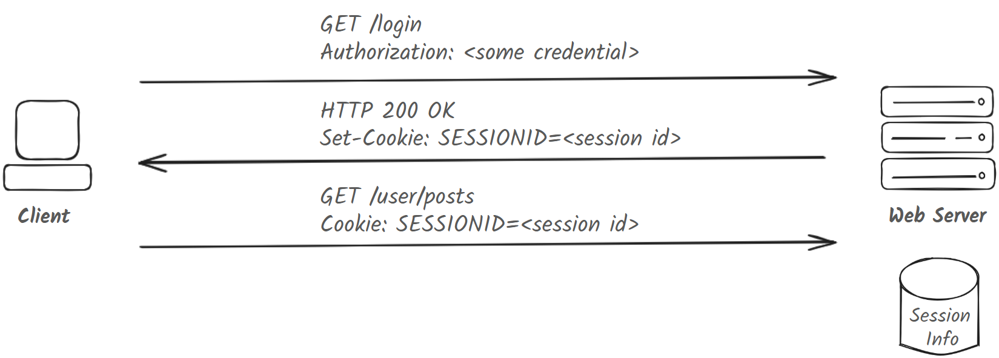
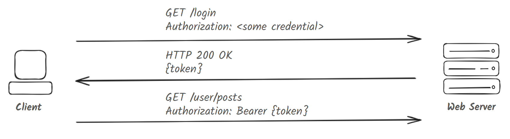
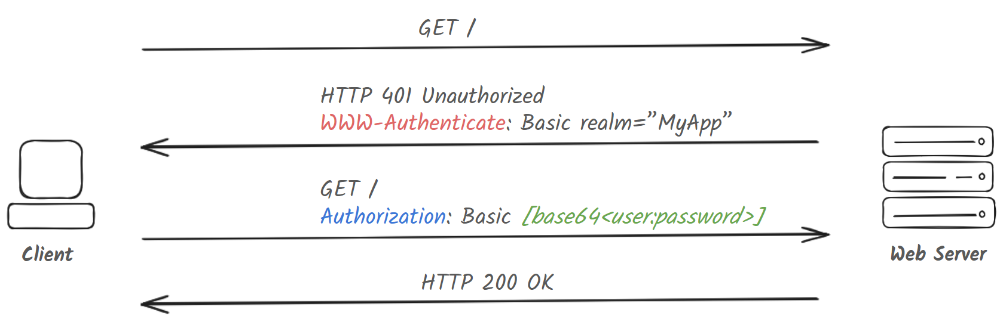
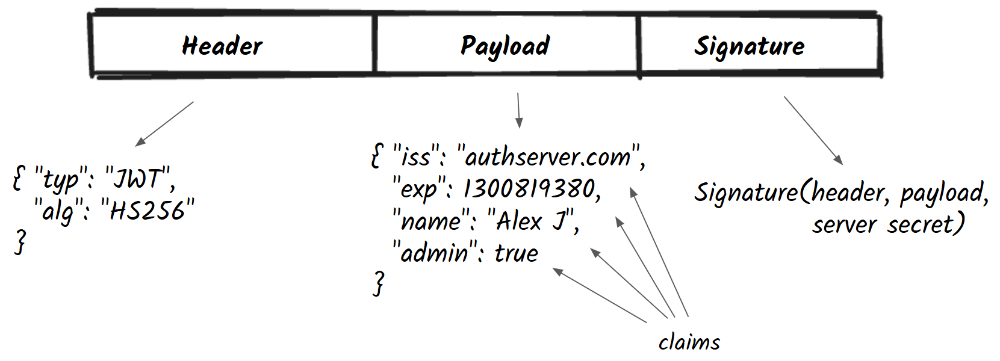

## Definition
Authentication is the process by which a user or application identifies itself to another application or system. Authorization is the validation that they are allowed to perform an action on a resource within the system.
 
Passwords, cryptographic tokens, and biometrics are some of the common ways of authentication. Authentication schemes authenticating human users can differ from those authenticating machines (devices or applications).

## Factors in Authentication
Factors in authentication are means to provide authentication to a system. They are broadly categorized as follows -

- Knowledge Based

  Something you know i.e. “here is something only you could have known, so it must be you”
  * Password (memorized phrase)
  * PIN (numerical code)
  * Security Questions (“what’s your first pet’s name?”, “where did you go to school?”)

- Possession Based

  Something you have i.e. “here is something only you could possess, so it must be you”
  * Mobile phone (automated phone call, SMS, authentication apps)
  * Smart card
  * Hardware Tokens
  * Magic Link (URL with embedded tokens)

- Inherence Based

  Something you are i.e. "these are physical characteristics unique to you"
  * Fingerprint
  * Facial recognition
  * Retinal/Iris Scan

  With biometrics, accuracy and privacy can be a problem.

- Behavioral

  Something you do i.e. “this is something you do that is unique to you”
  * Voice recognition
  * Handwriting/signature recognition
  * Typing patterns/speed

- Location Based
  
  Somewhere you are
  * Geolocation
  * IP based

> Multi-factor Authentication: Using more than one factor for authentication, usually 2FA or 3FA
> 
> 2FA (Two factor authentication): Using two factors for authentication
> 
> 3FA (Three factor authentication): Using two factors for authentication
>
> Passwordless: Using factor(s) other than "something you know"

## Authentication Methods For The Web
There are two common designs for authentication systems - they can be session-based or token-based. Each defines a way to connect and establish an authenticated connection with the web server. Since HTTP is a stateless protocol, servers need a way to avoid having to re-authenticate a user everytime they make a request.

### Session-based Authentication



The server creates a “session” associated with a user and stores it in its database. A unique `sessionID` string corresponding to the session is sent back to the HTTP client on successful authentication. The `sessionID` is attached as a header in every subsequent client request so the server can identify the requestor.

Session-based auth is usually done using HTTP Cookies, but can also be done through HTTP form fields and URLs. 

If the web application consists of several web servers behind a load balancer, session information needs to be replicated and synchronized across all servers, adding complexity. By design, it also makes it challenging for a session from one web application to be re-used on another web application. This is not an ideal scheme for authenticating APIs since API endpoints are designed for singular request/response interactions and don’t maintain sessions.


### Token-based Authentication



After authentication, the server creates a cryptographically signed token with some “claims” and sends it back to the client. The client attaches these tokens in their header while making subsequent requests. The server verifies the token’s signature and associated claims to authenticate the user.

Unlike sessions, tokens contain sufficient information to authenticate a user and eliminate the need for the server to store the user’s authentication information. This allows a token to be passed to a different web server (or web application) without needing re-authentication. The tokens can store information about the user and session. They usually contain an expiry time and a web server will not accept any token that has passed this time.

JWT (JSON Web Token) are a popular format for cryptographic tokens.

### Comparing Sessions and Tokens
The network round-trip time to pull session information from a database for session-based auth is likely more expensive than the time it takes for HMAC signature verification used in token-based auth. With the latter, token generation can be decoupled from token verification, allowing the use a separate servers for each. With the use of `sessionID`s, this isn’t as easy to do.

Session based auth is commonly done with cookies, making it more targeted towards web browsers. Applications outside the browser, mobile applications and IOT devices work better with tokens since they can more easily attach them to HTTP request headers and don’t have to implement cookie management. Some webapps may combine both session and token based authentication.

Ultimately, both session and token based auth rely on the client presenting some bytes of data to the web server that prove its identity.


## Case Studies
### #1 HTTP Basic Auth



HTTP Basic auth is widely supported by web browsers and server frameworks.

1. When a server uses HTTP Basic auth, it responds back to an HTTP request to a protected resource with a `401 Unauthorized` response status and the `WWW-Authenticate` header.

2. The client sees the `WWW-Authenticate` header and value **"Basic”**, indicating the auth scheme.

3. When the client is a browser, it prompts its user to enter a username and password. The additional “realm” parameter defines a “protection space” i.e. as long as resources hosted on a server are in the same realm, the browser can cache and re-use the same credentials provided by a user, obviating the need to prompt them every time.

4. The client takes the username and password and Base64 encodes it. It then makes the same request with the `Authorization` header and the encoded credentials.

5. The server checks its database to verify the username and password match. It sends back a `200` response if they match. Otherwise it repeats the `401`.

Base64 encoding is not a form of encryption and hence Basic Auth should only be used over a secure channel such as HTTPS/TLS.

### #2 API Key Auth

Authorization is done using of a API Key known only to the client and server. The client performs a one-time registration with the server and receives a unique API key.

The key is attached to every request made to the server. The server will check its database to determine which client the key belongs to.

The key can be used in the request in the following ways -

 * Query String: `GET /posts?api_key=<api_key>`

 * Request Header:  `X-API-KEY: <api_key>`

 * POST request body

This is in essense just a variation of HTTP Basic auth. Having the same drawbacks as basic auth, the recommendation is to use this over a secure channel.

### #3 JWT Authentication

JSON Web Tokens (pronounced "jot") are a way of encoding claims into a JSON object for transmitting information between parties. Claims are statements made by one subject about itself or other subjects.

The standard format of a JWT is `<HEADER>.<PAYLOAD>.<SIGNATURE>`



Claims specify what a subject is or isn't (authentication information). They don't specify what a subject can or cannot do (authorization information).

Tokens may be signed using HMAC and a secret or using RSA keys.

## Password Storage
We discuss several ways for web applications to store passwords in their database.

1. **[Terrible]** Store in database in plaintext. If the database is compromised, all customer accounts are compromised.

2. **[Less Bad]** Encrypt passwords with a key and store the encrypted passwords separately from the key. Attackers will now need to compromise the database as well as the key.

3. **[Better]** Store hashes of passwords. Since hashes are one-way functions, even if the database is leaked, it will be difficult for the attacker to figure out the original password.

   ```Hash = H(Password)```

   Hashes can reveal that two users have the same password, because the hashes of their passwords will match. Hackers can try to brute-force the password by computing hashes for every possible password.

   Hackers use “rainbow tables” which are large tables of pre-computed hashes for all password possibilities. These can grow to several hundred gigabytes, depending on the length of the keys and character space. Lookups in rainbow tables are faster than trying to compute all possible password combinations.

4. **[Even Better]**
   Store hashes of passwords along with a “salt”, which is a random string appended to the password while generating its hash. Salts should be unique for every user.

   ```Hash = H(Password + Salt)```

   It is okay to store salts with their corresponding hashes in the database, because the primary purpose of a salt is to render rainbow tables ineffective. Even if a hacker gain access to hashes and their corresponding salts, they are forced to brute force all combinations with that salt. For a sufficiently long and random password string, this should take an unfeasibly large amount of time.

   You can even add a random “pepper” along with the salt, which is a constant stored in source code. This way the hacker would need to compromise the database as well as the source code to attempt cracking passwords.

   ```Hash = H(Password + Salt + Pepper)```
